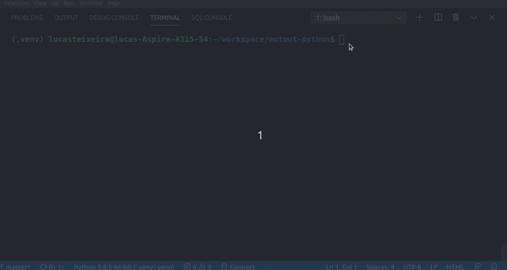

# teste_mutacao
Avaliando a qualidade dos teste unitários
***  
https://www.google.com/search?q=pip3+install+venv&oq=pip3+install+ven&aqs=chrome.0.0j69i57j0i22i30l6.10785j0j4&sourceid=chrome&ie=UTF-8
O teste de mutação verifica a qualidade dos testes unitários ou de componentes. Cada componente recebe um mutante.

### Como Funciona?

Esse mutante pode alterar o código (só durante a execução do teste). Por exemplo, alterar os operadores lógicos e operadores aritiméticos de cada função e verificar se seu teste unitário atua para prevenir/cobrir este comportamento. Caso não, o mutante sobrevive e significa que seu teste unitário não cobre todos os cenários ainda. O log do teste exibirá as alterações e sugestões para melhorias na sua base de testes.

### Dependências:

- Venv `python3 -m venv .venv`  
  - Ativar Venv `source .venv/bin/activate`  
- MutPy `pip3 install mutpy`  

### Para Rodar:

`mut.py --target calculator.py --unit-test tests.py -m --report-html relatorio`

### Site do Projeto

[MutPy](https://pypi.org/project/MutPy/)  
Multpy possui suporte também para Pytest    

### Para mais informações: 
[Live De Python - Dunossauro](https://www.youtube.com/watch?v=wczL0iDtmuw&t=2267s)
